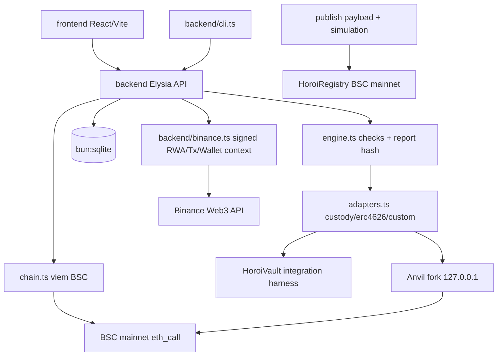

# Architecture

## Components



## Trust boundaries

| Zone | Privilege |
|------|-----------|
| BSC mainnet | read-only (`eth_call` / view) |
| Anvil fork | mutable local state only; never broadcast |
| API server | no publisher key; no custody |
| Publisher wallet | signs `publish` on mainnet externally |
| Registry | no external calls; no token transfers |

## Run state machine

```
CREATED → INSPECTING → FORKING → BASELINE → SCENARIOS
→ EVALUATING → HASHING → PASS | FAIL | INCOMPLETE
Infrastructure failure → ERROR
```

Terminal statuses are immutable. Rerun creates a new `runId`.

## Deterministic hashing

- `suiteHash = keccak256(canonical JSON of suite manifest)`
- `resultHash = keccak256(canonical semantic report payload)` with checks sorted by ID and evidence bound; runtime `runId`/`testedAt`/duration and Binance context are excluded
- `contextHash = keccak256(canonical normalized Binance observation)`; price, market status, observation time, and call latency stay outside `resultHash`
- Registry `reportId = keccak256(abi.encode(chainid, asset, target, suiteHash, resultHash, blockNumber))`
- Suite `HOROI-BSTOCK-1@1.2.0` binds the observed effective claim from the adapter boundary; this semantic change intentionally bumped the suite version/hash.

## Fork policy

1. Resolve/pin BSC block; store number + hash + RPC host class (no secrets).
2. Start Anvil fork.
3. Inspect interfaces; baseline adapter actions.
4. Discover authorized multiplier updater from `owner()`, enumerable `DEFAULT_ADMIN_ROLE`, or recent `UIMultiplierUpdated` transaction sender, then impersonate only on the local fork.
5. Fund isolated test users from an actual holder on the fork (optional explicit holder override). No storage mutation is used.
6. Each forward split, reverse split, and dividend scenario runs from an independent snapshot.
7. If transition cannot be reproduced → required checks `INCOMPLETE` (`FORK_MUTATION_UNAVAILABLE`).
8. **No `anvil_setStorageAt` / `vm.store` manufacturing of PASS.**
9. Tear down fork; persist report.

## Integration harness

`backend/HoroiVault.sol` is a minimal single-asset ERC-4626-shaped harness. It stores
raw bStock amounts as the canonical accounting unit, tracks proportional shares for
multiple users, and supports deposit/redeem/withdraw. It has no multiplier mutation,
fees, trading, governance, arbitrary calls, or upgradeability.

`backend/tests/NaiveHoroiVault.sol` is deliberately labeled `TEST/INCOMPATIBLE`. It
keeps the same basic deposit/redeem mechanics but snapshots effective units, allowing
the engine to demonstrate a deterministic `INVARIANT_MULTIPLIER_IGNORED` failure. Neither
contract is presented as an external production protocol.

## Publication simulation

The exact registry calldata is generated from the report arguments and wrapped for the
official Binance Transaction API simulation request as:

```json
{
  "binanceChainId": "56",
  "evmTx": { "from": "0x...", "to": "0x...", "value": "0", "data": "0x..." }
}
```

The canonical publication payload identity includes `chainId`, `from`, `to`, `value`,
and `data`. Any change invalidates prior simulation evidence. No registry address is
invented in this PR; live simulation remains blocked until HoroiRegistry is deployed.

## Registry

Immutable summary anchor. Test evolution = new suiteHash, not proxy upgrades.
